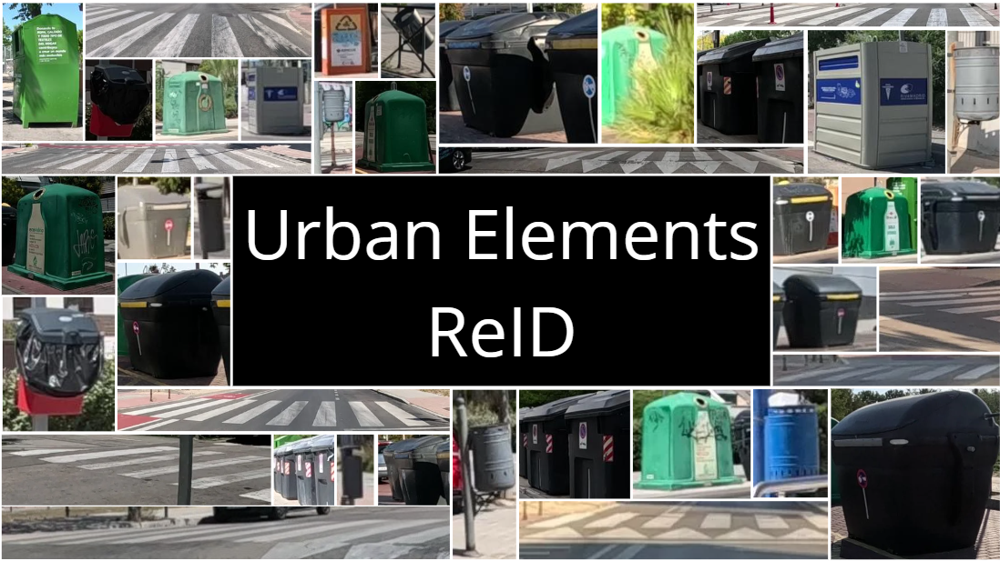

# Urban-Elements-ReID---baseline
In this repository, you can find instructions on how to download, configure, and run the baseline for the [Urban Elements ReID competition](https://www.kaggle.com/competitions/urban-elements-re-id-challenge-2026/overview).

<p align="center">
  
</p>

## Download code and set up enviroment
To download the main code and set up the environment, please follow (at least) the first 3 steps of [Part Aware Transformer](https://github.com/liyuke65535/Part-Aware-Transformer).

## Modified codes
In order to use PAT for the [Urban Elements ReID competition](https://www.kaggle.com/competitions/urban-elements-re-id-challenge-2026/overview) follow the next steps:

### 1) Download the UrbanElementsReID dataset
Download the UrbanElementsReID dataset from the section [Data](https://www.kaggle.com/competitions/urban-elements-re-id-challenge-2026/data) in the Kaggle competition page and place it in the directory of your choice.

Once the dataset is downloaded run the `setup.sh` script over the dataset directoy in order to place the folders in the correct way. You can find this script in `/Codes/setup.sh`

```bash
cd "your data directory"
```

```bash
bash setup.sh
```

If needed give permissions to access the folders running
```bash
chmod +x "folder name"
```


### 2) Add the required files
Add to the folder `Part-Aware-Transformer/data/datasets/` the dataloaders and initialization files `UrbanElementsReID.py`, `UrbanElementsReID_test.py` and `__init__.py`.

Add to `Part-Aware-Transformer/config/` folder and set up the correspondig paths and configuration of `UrbanElementsReID_test.yml` and `UrbanElementsReID_train.yml` files.

Add to `Part-Aware-Transformer/utils/` the file `re_rankig.py`.

Add to `Part-Aware-Transformer/` the evaluation file `update.py`

### 3) Set up configuration files

Modify the configuration files `UrbanElementsReID_test.yml` and `UrbanElementsReID_train.yml` and set up your path to the data directory (DATASET:ROOT_DIR), pretrained model weigths (MODEL:PRETRAIN_PATH and TEST:WEIGHT) and output directory.

### 4) Train the model
In order to train the model first make sure that all the configuration settings and paths are correct. Then run the following line:

```bash
python train.py --config_file "config/UrbanElementsReID_train.yml"
```

### 5) Inference (Result Track Submission Generation)
To generate the final ranking for the competition, use the update.py script. This will process the test images and create a track_submission.csv file containing the top 100 candidates for each query. This file is what you typically upload to Kaggle or use for final scoring.

```bash
python update.py --config_file "config/UrbanElementsReID_test.yml" --track "path to store the files/track.txt"
```
### 6) Local Evaluation (mAP & CMC Metrics)
If you want to calculate the performance of your model locally (without uploading to Kaggle) in the [UAM dataset external data](http://www-vpu.eps.uam.es/challenges/UrbanReIDChallenge2026//), use the evaluation script. This script compares your generated track_submission.csv against the ground truth (query.csv and test.csv) to calculate Mean Average Precision (mAP) and Cumulative Match Characteristic (CMC) curves.
```bash
python Evaluate_csv.py --path "path/to/dataset/csv_folder/" --track "path/to/track_submission.csv"
```
### References
[1]. Paula Moral, Alvaro García-Martín, Jose M. Martínez. (2024). Long-term geo-positioned re-identification dataset of urban elements. IEEE International Conference on Image Processing (ICIP), pp. 124-130, https://10.1109/ICIP51287.2024.10647759.

[2]. Javier Galán, Miguel González, Paula Moral, Álvaro García-Martín, José M. Martínez. (2025). Transforming urban waste collection inventory: AI-Based container classification and Re-Identification. Waste Management, Volume 199, pp. 25-35, https://doi.org/10.1016/j.wasman.2025.02.051.

### Acknowledgment 
Special thanks to liyuke65535 for the creation and publication of [Part Aware Transformer](https://github.com/liyuke65535/Part-Aware-Transformer) repository and congratulations for the excelent work.

This work has been supported by the Ministerio de Ciencia, Innovación y Universidades of the Spanish Government under project SEGA-CV (TED2021-131643A-I00)
